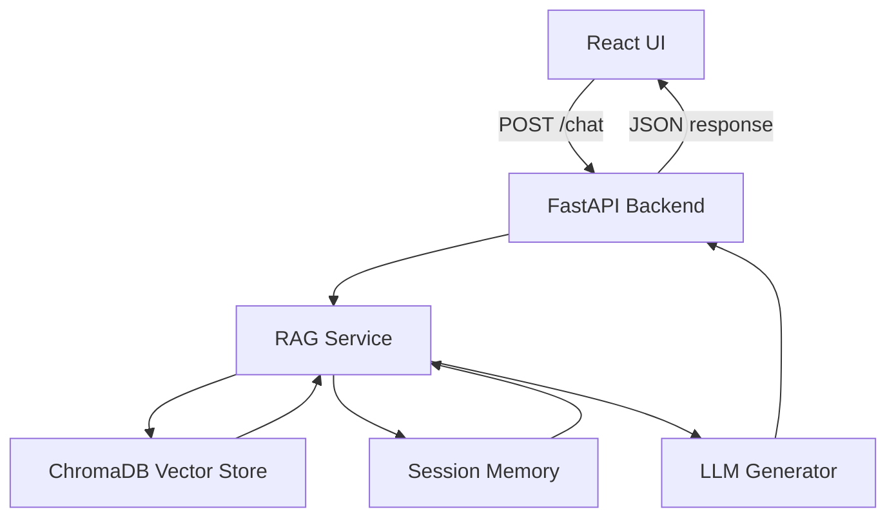

# GenAI Banking Support Chatbot

A production-ready Retrieval-Augmented Generation (RAG) banking assistant built with FastAPI, ChromaDB, and a React chat interface.

## Project Structure

- `backend/`: FastAPI service with RAG pipeline, document ingestion, vector store, and session memory.
- `frontend/`: React + Vite chat UI communicating with backend APIs.
- `backend/data/`: Example synthetic banking dataset and support documentation.

## Features

- Chat-based banking support UI
- Document upload and ingestion
- Semantic chunking and embedding storage
- Vector retrieval with ChromaDB
- Context-aware generation and short-term session memory
- Clean architecture and modular codebase

## Local Setup

1. Install backend dependencies
   ```powershell
   cd backend
   python -m venv .venv
   .\.venv\Scripts\Activate.ps1
   pip install -r requirements.txt
   ```

2. Run backend
   ```powershell
   uvicorn app.main:app --host 0.0.0.0 --port 8000 --reload
   ```

3. Install frontend dependencies
   ```powershell
   cd frontend
   npm install
   npm run dev -- --host 0.0.0.0
   ```

4. Open browser to the frontend URL shown by Vite.

## Environment Variables

- `OPENAI_API_KEY` (optional): Use OpenAI for enhanced LLM generation. If omitted, the backend falls back to a local transformer model.
- `CHROMA_DB_DIR` (optional): Directory path for ChromaDB persistence.

## Deployment

The backend is deployable using Docker and any container-friendly platform such as Render or Railway. This repo includes `backend/Dockerfile` and `render.yaml` for quick deployment.

> Note: a public live URL is not available from this local workspace, but the deployment configuration is ready to connect to Render or Railway.

## Architecture Overview

- Frontend: React chat UI built with Vite.
- Backend: FastAPI API layer with validation, error handling, and session memory.
- Document ingestion: PDF, TXT, and DOCX extraction plus semantic chunking.
- Embeddings: `sentence-transformers/all-MiniLM-L6-v2` for text vectorization.
- Vector store: ChromaDB with persistent storage for fast semantic retrieval.
- Generation: OpenAI when `OPENAI_API_KEY` is present; local `gpt2` fallback otherwise.

### Architecture Diagram



### Data Flow

1. User sends a message from the React UI.
2. Backend receives `/chat` with `session_id` and query.
3. The RAG service retrieves top-k relevant chunks from ChromaDB.
4. The generation layer combines retrieved context and recent session memory into a prompt.
5. The LLM returns a grounded answer, which is persisted in session memory.

## Demo Script

See `README_DEMO.md` for a scripted walkthrough of the project and architecture.
